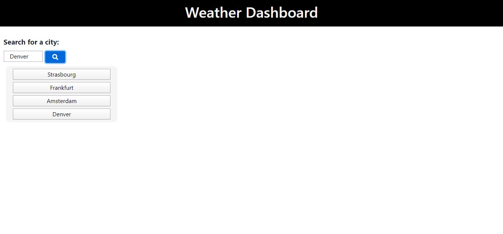
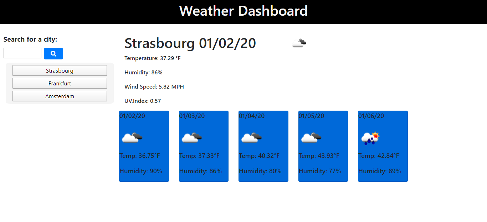

# Five_Day_Weather_API

## Function 
The webpage is divided into two main containers. The top left most section contains a search box that submits with a an enter, or a button click. After typing a city name, and pressing enter or clicking the submit button, a button with that name will append to the bottom of the button div. After selecting any city button, to the right the current weather and a five day forecast will appear.  

 

## Intended Use

The intended use for this project is for someone perhaps traveling or keeping up with traveling family needing to keep up with several locations weather and its forecast. 

## Credit
Used font awesome for the save icon.
https://fontawesome.com/license

## Link to Deployed Product

https://mnorthup2207.github.io/Five_Day_Weather_API/